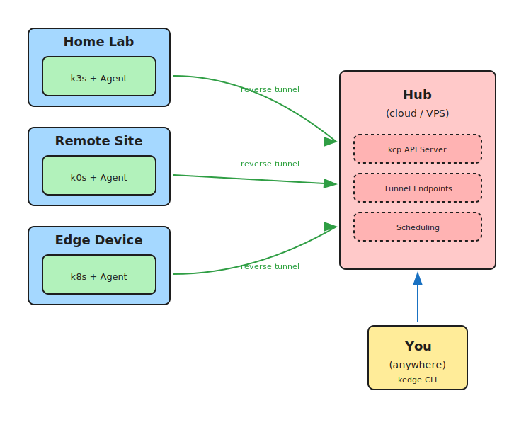

# Kedge

The ultimate home lab tool for managing distributed Kubernetes clusters.

## Why Kedge?

Managing multiple Kubernetes clusters across your home lab, remote locations, or edge sites is painful. You end up juggling kubeconfigs, SSH tunnels, VPNs, and port forwards. Kedge solves this by providing a single control plane that connects all your clusters through secure reverse tunnels.

**Perfect for:**

- **Home labs** — Manage k3s/k0s clusters on Raspberry Pis, NUCs, or old laptops from anywhere
- **Remote sites** — Connect clusters behind NAT, firewalls, or without public IPs
- **Edge deployments** — Deploy workloads to distributed locations with simple placement rules
- **Small teams** — Multi-tenant workspaces with OIDC authentication

## How It Works



Built on [kcp](https://github.com/kcp-dev/kcp) for multi-tenant workspace isolation and [Dex](https://github.com/dexidp/dex) for OIDC authentication.

## Components

| Component | Description |
|---|---|
| **Hub** (`kedge-hub`) | Central control plane — hosts the API, authentication, tunnel endpoints, and scheduling |
| **Agent** (`kedge-agent`) | Runs on each site — establishes tunnels, reports status, reconciles workloads |
| **CLI** (`kedge`) | User tool — login, register sites, deploy workloads |

## Key Resources

| Resource | Scope | Description |
|---|---|---|
| `Site` | Cluster | A connected Kubernetes cluster |
| `VirtualWorkload` | Namespace | Workload definition with placement rules |
| `Placement` | Namespace | Binding of a workload to a specific site |

## Quick Start

```bash
# Clone and build
git clone https://github.com/faroshq/kedge.git
cd kedge
make build

# Terminal 1: Run the hub (embedded kcp + static token auth)
make run-hub-embedded-static

# Terminal 2: Login and register a site
make dev-login-static    # Authenticate with static token
make dev-site-create     # Register a site
make dev-run-agent       # Start the agent on a local kind cluster
```

That's it! The hub runs with embedded kcp and static token authentication — no external dependencies required.

### Deploy a test workload

```bash
make dev-create-workload  # Deploy a sample nginx workload
```

### Other development modes

Run `make help-dev` to see all available modes:

| Mode | Command | Description |
|------|---------|-------------|
| **Standalone** | `make run-hub-embedded-static` | Embedded kcp + static token (no deps) |
| **With OIDC** | `make run-dex` + `make run-hub-embedded` | Embedded kcp + Dex OIDC |
| **External kcp** | `make dev-run-kcp` + `make run-hub-static` | External kcp + static token |

## Requirements

- Go 1.25+
- Docker
- kind (for local agent cluster)

## Documentation

Full documentation is available at the [docs site](https://faroshq.github.io/kedge/).

- [Getting Started](https://faroshq.github.io/kedge/getting-started.html)
- [Developer Guide](https://faroshq.github.io/kedge/developers.html)
- [Security (tokens & OIDC)](https://faroshq.github.io/kedge/security.html)
- [Ingress Setup](https://faroshq.github.io/kedge/ingress/)
- [Helm Deployment](https://faroshq.github.io/kedge/helm.html)
